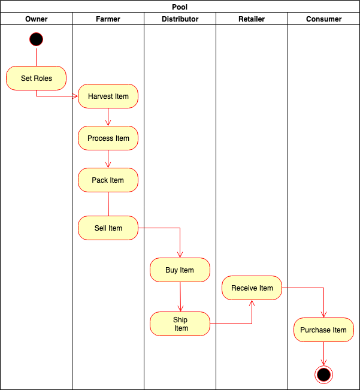

# José Marcelo Santuci - Udacity Blockchain Course - Project 5

This is the submission of Project 5 of Udacity Blockchain course.

1. Contract Address: 0x94cC82D6B4E132f105A0BA2881A7c291f42ef830
2. Libraries: I used chai and truffle-assertions to check events in unit tests and any-promise, bindings and truffle-assertions to deploy to rinkeby network
3. Program version: 1.0.0
4. Node version: v10.16.0
5. Truffle version: v5.0.24 (core: 5.0.24)
6. Web3 version: 2.1.2

## UML

### Class Diagram

### Sequence Diagram

### State Diagram

### Activity Diagram

